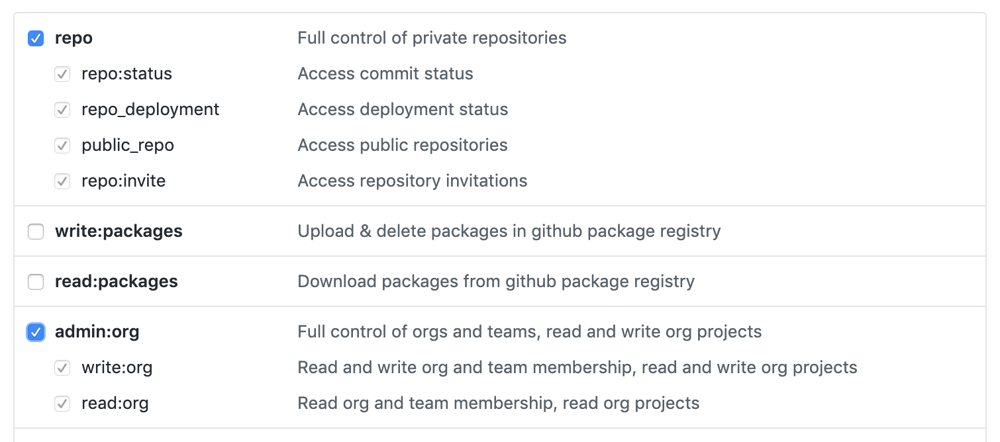

# @sparkbox/carbon-cli

[](https://circleci.com/gh/sparkbox/carbon-cli/tree/master)
[](https://codeclimate.com/github/sparkbox/carbon-cli/maintainability)
[](https://codeclimate.com/github/sparkbox/carbon-cli/test_coverage)
[](https://www.npmjs.com/package/@sparkbox/carbon-cli)
[](https://opensource.org/licenses/MIT)
<!-- [](https://conventionalcommits.org) -->

## 🚧 Under Development

## Install
```sh
$ npm i -g @sparkbox/carbon-cli
```

Alternatively, you can run it without a global install:

```sh
$ npx -p @sparkbox/carbon-cli carbon
```

## Why?
Accelerated project setup. Use existing repos as templates.

## Usage
### `carbon`
After installing, you should have a `carbon` command. Running with no options will walk you through a repo setup...

```sh
$ carbon

? GitHub username or email iamnathanj
? GitHub password ◦◦◦◦◦◦◦◦
? GitHub 2FA passcode 508412
? search repos bouncy-ball
? project name /Users/nj/code/bouncy-ball-copy
✔ initialize repo
✔ download bouncy-ball
✔ tidy up package.json
✔ customize project files
✔ create new remote on GitHub
✔ install dependencies
╭────────────────────────────────────────────────────────────────────╮
│                                                                    │
│   success!                                                         │
│                                                                    │
│   ❯ /Users/nj/code/bouncy-ball-copy                                │
│                                                                    │
│   ---                                                              │
│                                                                    │
│   url   https://api.github.com/repos/iAmNathanJ/bouncy-ball-copy   │
│   ssh   git@github.com:iAmNathanJ/bouncy-ball-copy.git             │
│   https https://github.com/iAmNathanJ/bouncy-ball-copy.git         │
│                                                                    │
╰────────────────────────────────────────────────────────────────────╯
```

This command requires authenticating with your GitHub account and selecting a repo as a starting point. The overall flow is:
- login to GitHub
- choose an existing repo to use as a template
- choose a branch to copy from (defaults to `master`)
- choose whether to create a new GitHub remote from the copy (defaults to `true`)

After that

### `carbon config`

This `config` command will add a set of configuration files for common front-end tooling. The generated files are intended to follow "best practices" but are somewhat opinionated. These are meant to be used as a starting point, but many will suffice as is.

The `configs` command is non-destructive. It will not overwrite any existing config files unless run in `force` mode.

## GitHub Authentication
The default `carbon` command provides a basic auth flow for GitHub so you can access your repos. You can alternatively provide a [personal access token](https://help.github.com/en/articles/creating-a-personal-access-token-for-the-command-line) via an environment variable called `CARBON_CLI_TOKEN` to skip the login step.

To set this up:
1. [create a token](https://help.github.com/en/articles/creating-a-personal-access-token-for-the-command-line#creating-a-token) with selected scopes for "repo" and "admin:org".

1. export the token value from your `.bashrc` (or similar).

One way of doing this is to create a file specifically for personal or secret information.
```sh
# ~/.secrets
export CARBON_CLI_TOKEN=xxxxxxxxxxxxxxxxxxx
```

Then `source` that file from your shell startup.
```sh
# .bashrc
source ~/.secrets
```

## Contributing
Yes, please!

See the [contributing guidelines](./CONTRIBUTING.md) for details.

## Platform Requirements

TODO
